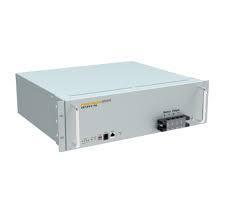
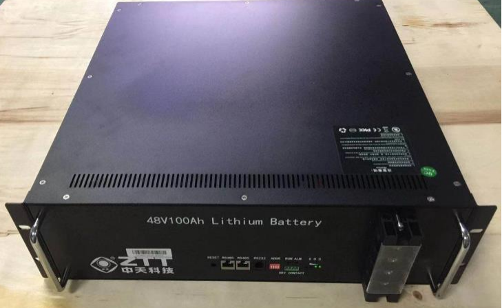

  <h1>TinkerBMS</h1>
  
Python library to read/write BMS via RS485/RS232

  
  

## Why TinkerBMS?

There's already an excellent BMS reader - [`dbus-serialbattery`][dbus-serialbattery].
But it is for [Venus OS](https://github.com/victronenergy/venus) only.
I'd like to do the same on any platform - PCs, microcontrollers, and SBCs.

### What TinkerBMS is:

* a reusable Python library, so that it can be run on Raspberry Pi and any SBCs/PCs.
* inherit the `Battery` abstract class of `dbus-serialbattery`, so that it'll support as many BMS as `dbus-serialbattery` does.

### In hopes to (be)

* support [MicroPython](https://github.com/micropython/micropython) compatible for running on microcontrollers
* support more BMS protocols that `dbus-serialbattery` doesn't yet
* support more interfaces, e.g. CAN, SMbus, Bluetooth(LE)

## BMS Communication Protocols

| Battery  | Vendor                  | Protocol                                             |
| -------- | ----------------------- | ---------------------------------------------------- |
| 48NPFC50 | [MPINarada][mfr-narada] | [Shinwa BMS Protocol](./doc/protocol-shinwa-bms.pdf) |
| ZTT48100 | [Zhongtian][mfr-ztt]    | [Zhongtian BMS Protocol](./doc/protocol-ztt-bms.pdf) |

(I hope more batteries are added in this list. But these two are only batteries that I have at the moment of writing.)

## Other Resources

* [Louisvdw/dbus-serialbattery][dbus-serialbattery]
* [darkbyte-ru/shinwa-bms](https://github.com/darkbyte-ru/shinwa-bms)
* [ForrestFire0/GenericBMSArduino](https://github.com/ForrestFire0/GenericBMSArduino)

[dbus-serialbattery]: https://github.com/Louisvdw/dbus-serialbattery
[mfr-narada]: https://mpinarada.com/
[mfr-ztt]: https://www.zttgroup.com/

***

  <h1>TinkerBMS</h1>
  
Python library to read/write BMS via RS485/RS232

